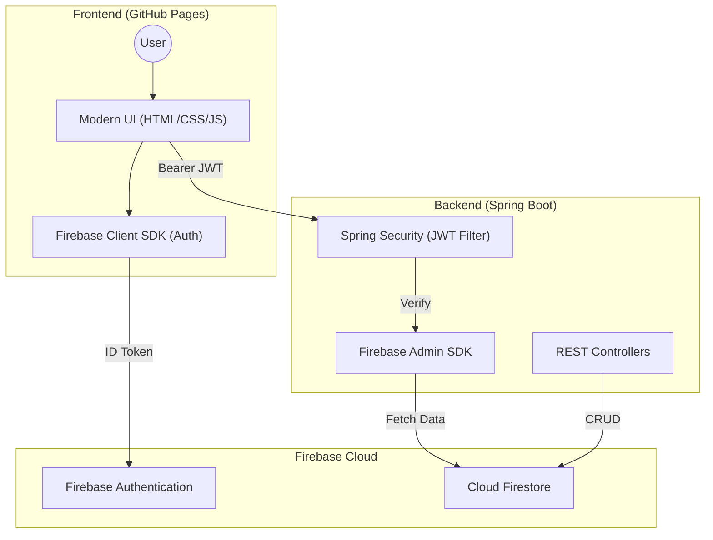

# DevBoard Architecture Overview

Visualizing the flow between the modern UI, the Spring Boot API, and the Firebase ecosystem.

### Tech Stack Details
- **Frontend**: Vanilla HTML/CSS/JS (Lightweight & Portable).
- **Backend API**: **Spring Boot 3.x** (Java 17+).
- **Security**: **JWT-based** authentication using Firebase ID Tokens.
- **Database**: **Cloud Firestore** (NoSQL, Serverless).
- **Deployment**: GitHub Pages (Frontend) + Containerized Host (Backend).
