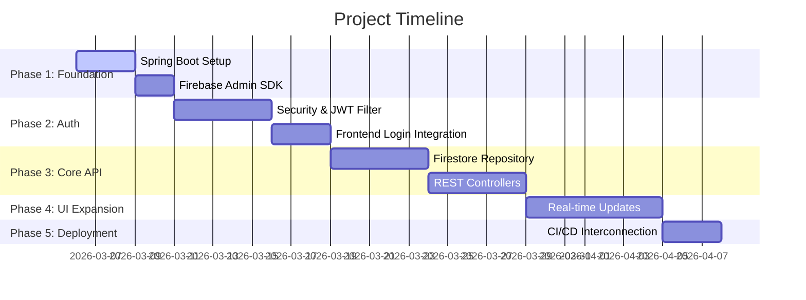

# DevBoard Project Roadmap

This roadmap outlines the path from the current static blueprint to a full-stack application with a Spring Boot backend and Firebase integration.

## Phase 1: Foundation & Backend Setup
- [ ] **Spring Boot Initializer**: Set up a Maven/Gradle project in the `/backend` folder.
- [ ] **Dependencies**: Include `spring-boot-starter-web`, `spring-boot-starter-security`, and `google-cloud-firestore`.
- [ ] **Firebase Admin SDK**: Generate and securely store the service account key.

## Phase 2: Authentication & Security
- [ ] **Firebase Auth**: Implement token verification middleware in Spring Security.
- [ ] **User Context**: Link Firebase UID to application user profiles.
- [ ] **Frontend Login**: Connect the UI login flow to Firebase Client SDK.

## Phase 3: Core API (CRUD)
- [ ] **Firestore Service**: Create a generic repository for task and project persistence.
- [ ] **REST Controllers**: Implement endpoints for `GET /tasks`, `POST /tasks`, `PUT /tasks`, etc.
- [ ] **Frontend Sync**: Replace static JS data with `fetch()` calls to the backend.

## Phase 4: UI Expansion & Real-time
- [ ] **Advanced Filtering**: Implement server-side search and filtering.
- [ ] **Real-time Updates**: Use Firestore listeners or WebSockets for instant UI updates.
- [ ] **Personalization**: User settings, dark mode persistence, and profile management.

## Phase 5: Deployment & CI/CD
- [ ] **Production Build**: Dockerize the Spring Boot application.
- [ ] **Render/Heroku/Railway**: Deploy the backend.
- [ ] **Interconnected CI/CD**: Ensure the frontend deployment links to the live API.
